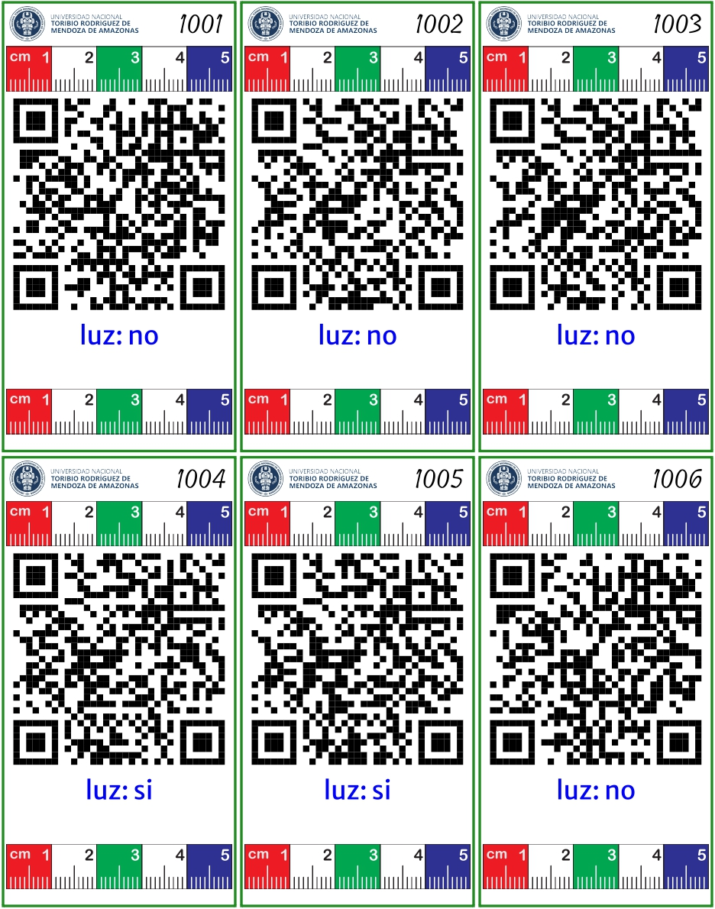
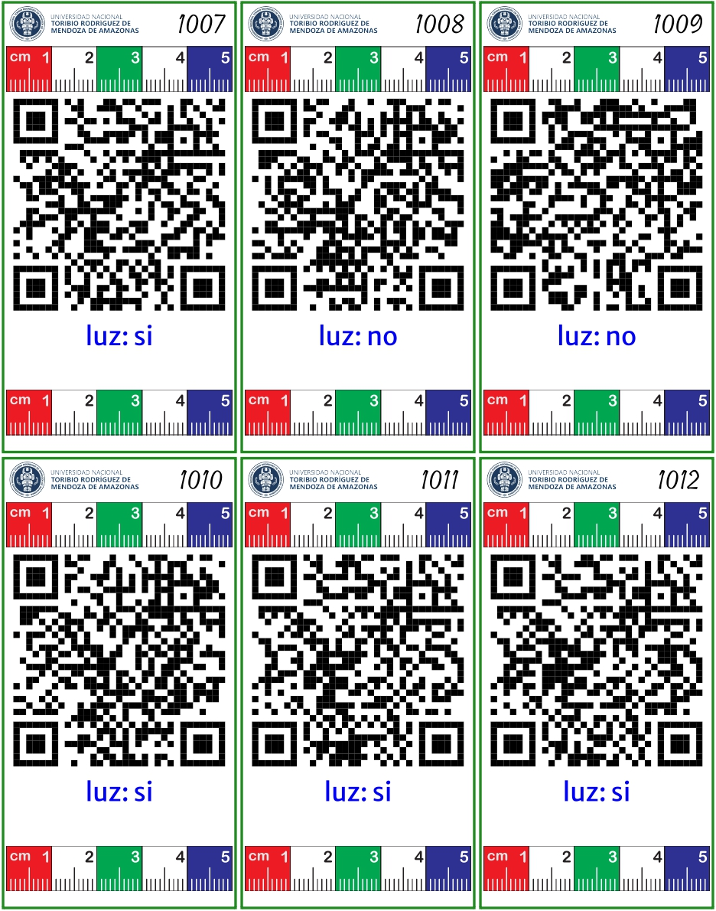

# Influencia de la luz en la germinación de semillas de zanahoria (*Daucus carota*)

------------------------------------------------------------------------

## Descripción del estudio

Este experimento tuvo como objetivo evaluar la influencia de la luz en la germinación de semillas de zanahoria, bajo un diseño completamente al azar (DCA), con dos tratamientos: presencia de luz y ausencia de luz.

Se emplearon 12 unidades experimentales, con 6 repeticiones por tratamiento, evaluando el porcentaje de germinación y el comportamiento de las semillas en cada condición.

------------------------------------------------------------------------

## Diseño experimental

-   Diseño: Completamente al azar (DCA)\
-   Tratamientos:
    -   T1: Con luz\
    -   T2: Sin luz\
-   Repeticiones: 6 por tratamiento
-   Total de unidades experimentales: 12

------------------------------------------------------------------------

## Integrantes

| Alumno                          | \% de participación |
|---------------------------------|---------------------|
| Colunche Vasquez Josué Jhonatan | 100 %               |
| Huaman Rimarachin Milver        |                     |
| Tuesta Chichipe Aracely         | 100 %               |
| Vasquez GuevaraJheferson Yoel   |                     |
| Visalot Chappa Jheiner Ivan     |                     |
|                                 |                     |

## Libro de campo

------------------------------------------------------------------------

<https://docs.google.com/spreadsheets/d/1jhF2lV6rksG_t3W5OkBvq6jgzAiZ78nCOap2Bf8QarQ/edit?gid=1844291628#gid=1844291628>

## Etiquetas

