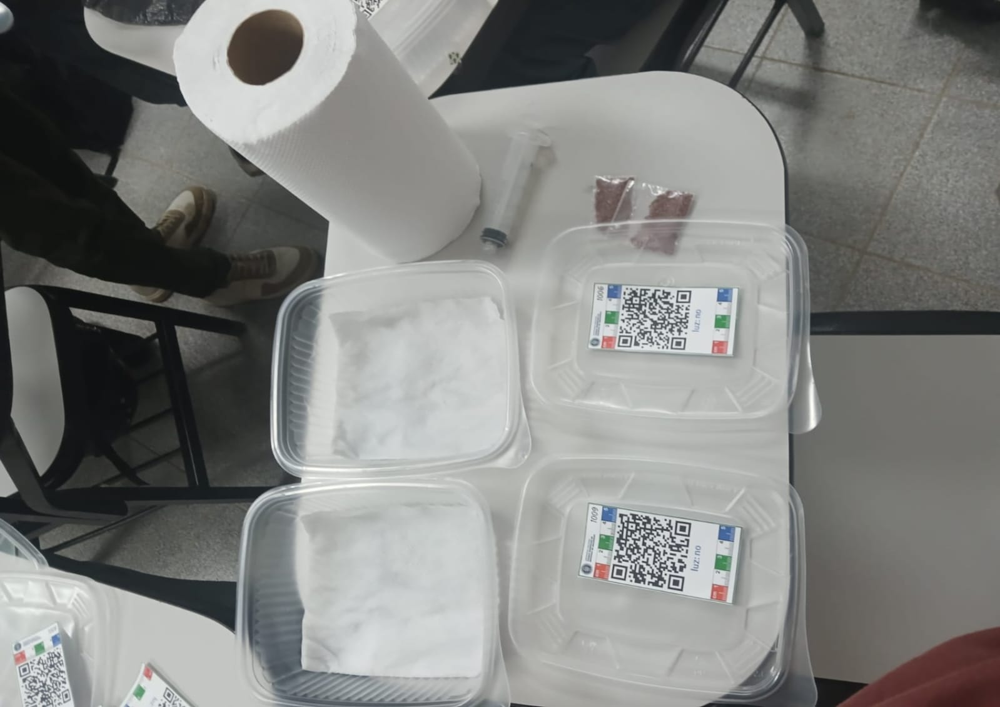
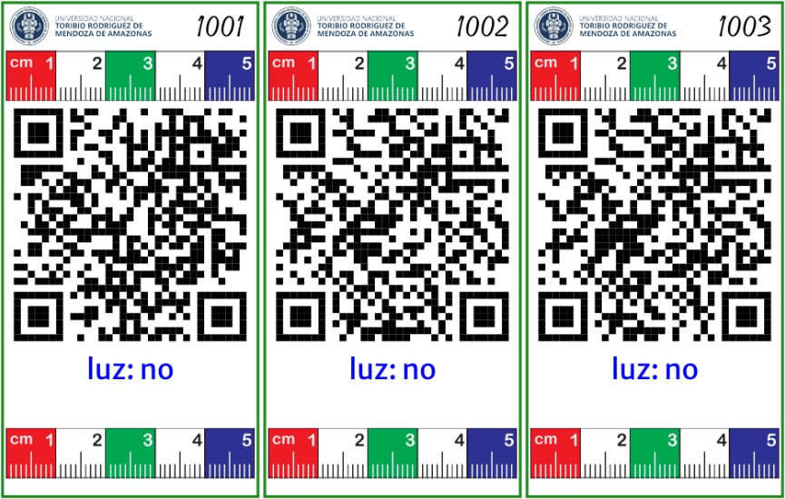
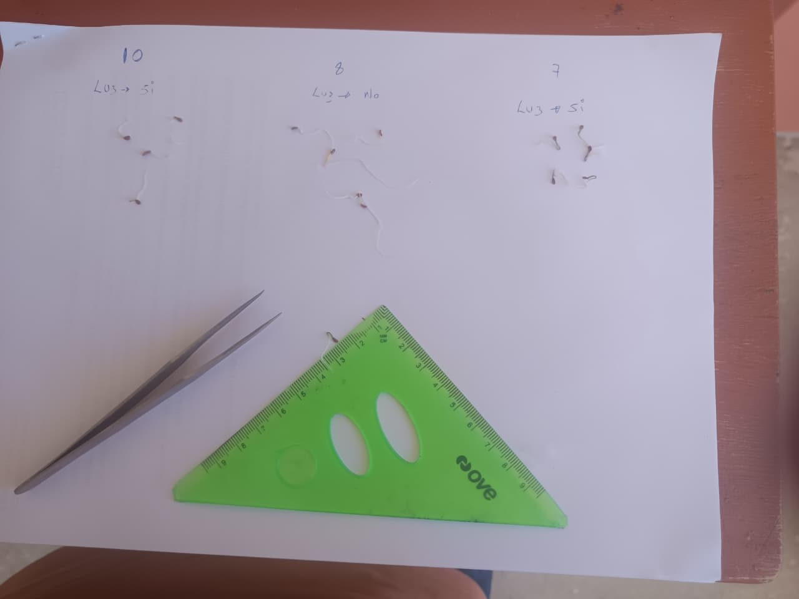

# Materiales

- Geringa

- 12 recipientes plásticos con tapa Papel toalla (como sustrato de germinación)

- 1 litro de agua mineral

- Pinza

- 300 semillas de zanahoria (Daucus carota)

- Guantes Cinta adhesiva

- Bolsas negras

  

# Métodos

Diseño experimental

El experimento se estableció bajo un Diseño Completamente al Azar (DCA), con dos tratamientos: presencia de luz y ausencia de luz. Se emplearon 12 unidades experimentales, con 6 repeticiones por tratamiento. Cada unidad experimental estuvo constituida por un recipiente plástico que contenía 25 semillas de zanahoria (*Daucus carota*).

{width="584"}

# Procedimiento experimental

En primer lugar, se generaron las etiquetas de identificación mediante el software R, las cuales fueron recortadas y colocadas en la parte superior de los recipientes plásticos, permitiendo la correcta identificación de cada unidad experimental.

{fig-align="center"}

Posteriormente, se acondicionaron los recipientes, colocando en su interior papel toalla como sustrato. Este fue previamente humedecido con agua mineral, con el fin de proporcionar condiciones adecuadas de humedad para la germinación.

{fig-align="center"}

Luego, con la ayuda de una pinza y utilizando guantes para mantener condiciones de higiene, se colocaron 25 semillas de zanahoria en cada recipiente, distribuyéndolas de manera uniforme sobre el papel toalla.

{fig-align="center"}

En el caso del tratamiento sin luz, los recipientes fueron cubiertos externamente con bolsas negras, aseguradas con cinta adhesiva, con la finalidad de impedir el paso de la luz y generar condiciones de oscuridad total.

{fig-align="center"}

Una vez preparados, los recipientes fueron tapados y asignados a los estudiantes, quienes trasladaron cada unidad experimental a sus respectivos domicilios para su evaluación.

El proceso de germinación fue monitoreado durante 7 días consecutivos, realizando observaciones diarias a las 20:00 horas, registrando la cantidad de semillas germinadas en un cuaderno de campo.

**Libreta de campo**

<https://docs.google.com/spreadsheets/d/1jhF2lV6rksG_t3W5OkBvq6jgzAiZ78nCOap2Bf8QarQ/edit?gid=1844291628#gid=1844291628>

Finalmente, al séptimo día, se procedió a medir la longitud de la radícula de las plántulas germinadas, como indicador del crecimiento inicial.

